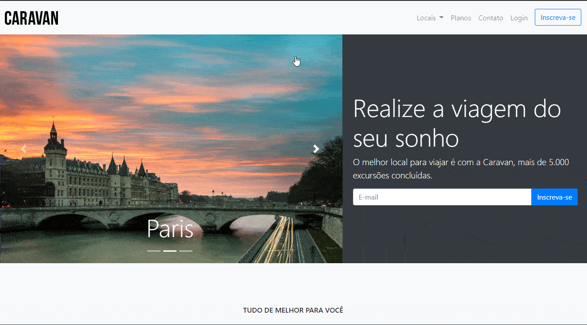

# Caravan

Projeto do curso <a href="https://www.origamid.com/curso/bootstrap-4/">Bootstrap 4
</a> da <a href="https://www.origamid.com/">origamid.com</a>.

Projeto realizado com o intuito de praticar a produção de páginas na web, utilizando o Bootstrap 4 para a criação de layout.

Me siga no <a href="https://www.linkedin.com/in/jose-de-souza/">Linkedin</a>